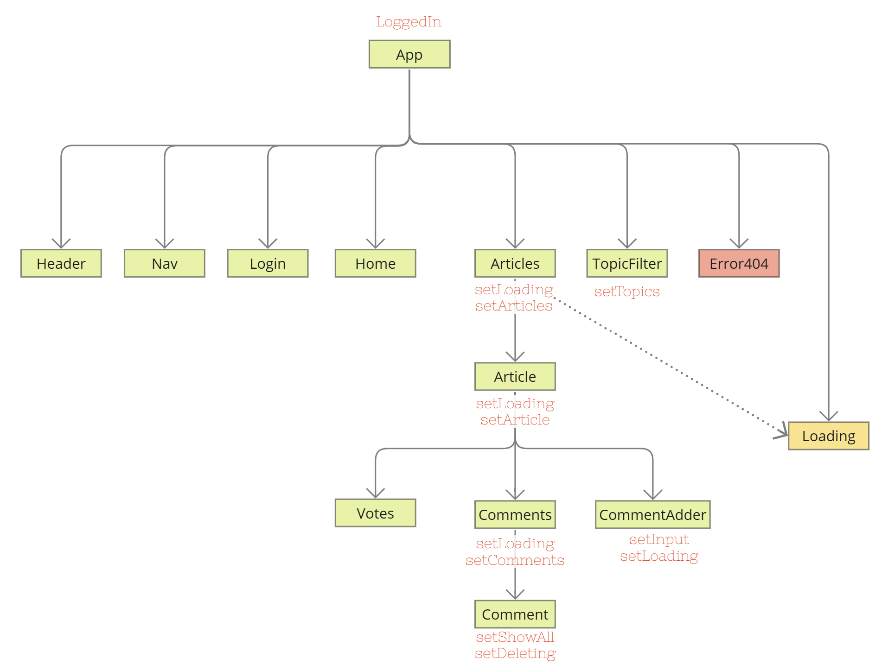

# NC News by Hadrian

This is the front end project for **NC News by Hadrian** - a social news aggregation, content rating and discussion web application. Anyone can get access to the articles and interactive tools, but users must be logged in to either like or comment on an article, or to be able to remove one of their own existing comments.

A 'mobile first' approach was adopted for this project, targetting users who browse on their mobile phones, but the responsive design enables a positive experience on browsers of any device.

## Technical overview
### Frontend

This application is bootstrapped with [Create React App](https://github.com/facebook/create-react-app), and deployed on Netlify. 

Diagram of the component hierarchy and location of states:

### Backend

The backend project is located in my [GitHub account](https://github.com/HadrianDeveloper/NC-News), and has a PSQL database hosted on [ElephantSQL](https://www.elephantsql.com/) with APIs on [Render](www.render.com). 

The BE setup includes an additional PSQL database for TDD using [Jest](https://jestjs.io/), with all data and seeding functions stored in /db. 

The project implements the MVC framework with asynchronous code handled by Promises.  